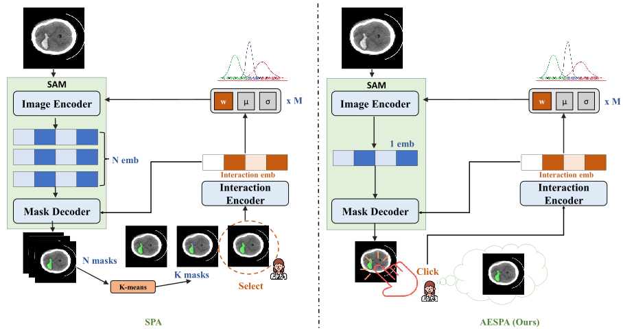

<h1 align="center">Leveraging Multi-rater Annotations
for Interactive Medical Image Segmentation</h1>

Project for the course AI7102 - Introduction to Deep Learning at MBZUAI, Fall 2025

## Overview 
 <div align="center"></div>
AESPA is a preference-aware interactive segmentation model built on top of MedSAM for medical images with multiple annotators (multi-rater). Instead of learning a single “gold” mask, AESPA explicitly models each annotator’s style: given user clicks, the model predicts a segmentation aligned with that rater’s annotations.

## What we developed
We extended our ideas from (ICCV 2025) [SPA: Efficient User-Preference Alignment against Uncertainty in Medical Image Segmentation](https://github.com/ImprintLab/SPA/tree/main). Compared to the original codebase, we developed new dataloaders to handle our datasets, a new functional file for training/validation of our architecture. We also cleaned the code in the `models` folder and developed a demo to show the effectiveness of our method. 

## Repository structure
**Folders:**

`assets`: image for architecture overvỉew and image indices for LIDC dataset.

`checkpoint`: user will create this folder to store downloaded checkpoints (not shown on github).

`conf`: common configurations.

`data`: data folder, refer to step 2 of the **Datasets and Training** session for more details (not shown on github).

`demo`: sample and demo code.

`logs_new`: storing training logs and checkpoints during training.

`models`: SAM model & configuration.

**Files:**

`.sh` files list the commands we used for training & ablations.

`aespa_demo.py`: demo file built on gradio.

`cfg.py`: pase input arguments.

`dataset.py`: datasets and dataloaders.

`function.py` and `function_aespa.py`: original & ours training/validation code.

`multirater_metrics.py`: additional metrics for multirater segmentation, inspired by MBHSeg challenge.

`process_mbhseg.py`: processing the MBHSeg dataset of nib images by windowing and channel splits.

`train.py` and `val.py`: run the training & validation with commands.

`utils.py`: ultilities (random click for SAM), grid drawing, etc.


## Requirement

 Install the environment:

 ``conda create -n seg_environment python=3.10``

 ``conda activate seg_environment``

 ``pip install -r requirements.txt``

## Datasets and Training
**Step1:** Download MedSAM pretrained weight and put in the ``./checkpoint/`` folder, create the folder if it does not exist:
 [MedSAM checkpoint](https://drive.google.com/drive/folders/1ETWmi4AiniJeWOt6HAsYgTjYv_fkgzoN?usp=drive_link) -> Select `medsam_vit_b.pth` file.
 

**Step2:** Download datasets to `data` folder:
- [MBHSeg](https://www.mbhseg.com/)
- LIDC-IDRI from GCS commands in [this notebook](https://colab.research.google.com/github/deepmind/deepmind-research/blob/master/hierarchical_probabilistic_unet/HPU_Net.ipynb#scrollTo=SY_lyR2BHRu9)
- [REFUGE](https://huggingface.co/datasets/realslimman/REFUGE-MultiRater/tree/main)

Then run `process_mbh.py` to process MBHSeg dataset. The final structure should look like this
```
data/
├── LIDC/
│   ├── train/
│   │   ├── gt/
│   │   │   ├──LIDC-IDRI-0001/
│   │   │   │   ├──z-105.0_c0_l0.png
│   │   │   │   ├──z-105.0_c0_l1.png
│   │   │   │   └──...
│   │   │   └── ...
│   │   └── images/
│   │       ├──LIDC-IDRI-0001/
│   │       │   ├──z-105.0_c0.png
│   │       │   └──...
│   │       └── ...
│   └── test/...
│
├── MBHSeg-Binary/
│   ├── train/
│   │   ├── gt/
│   │   │   ├──ID_0b10cbee_ID_f91d6a7cd2/
│   │   │   │   ├──slice_6_r1.npy
│   │   │   │   ├──slice_6_r3.npy
│   │   │   │   └──...
│   │   └── images/
│   │       ├──ID_0b10cbee_ID_f91d6a7cd2/
│   │       │   ├──slice_6.png
│   │       │   └──...
│   │       └── ...
│   └── test/...
├── MBHSeg-Multi/...
│
└── REFUGE-Multirater/
    ├── Training-400/
    │   ├── 0826/
    │   │   ├── 0826.jpg
    │   │   ├── 0826_seg_cup_1.png
    │   │   ├── 0826_seg_cup_2.png
    │   │   └──...       
    │   └── ...
    └── Test-400/...
 ```

 Or alternatively, simply download from our huggingface [dataset](https://huggingface.co/datasets/bampyeonji/multiraters/tree/main) and unzip.


**Step3:** Run the training & validation by:

- SPA:

``python train.py -exp_name 'LIDC_SPA' -sam_ckpt ./checkpoint/medsam_vit_b.pth -image_size 128 -b 64 -dataset LIDC -data_path './data/LIDC' -mode SPA``

- AESPA:

``python train.py -exp_name 'LIDC_AESPA' -sam_ckpt ./checkpoint/medsam_vit_b.pth -image_size 128 -b 64 -dataset LIDC -data_path './data/LIDC' -mode AESPA``

Other configs to try are listed in `bash.sh`

**Optional:** Download our [pretrained weight](https://huggingface.co/bampyeonji/aespa_lidc/tree/main) and put it in `checkpoint` folder

Run the validation by:

 ``python val.py -sam_ckpt './checkpoint/medsam_vit_b.pth' -weights './checkpoint/checkpoint_aespa_lidc.pth' -image_size 128 -b 1 -dataset LIDC -data_path './data/LIDC' -mode AESPA``

## Running the demo

**Step 1:** Make sure you have a trained model stored at `checkpoint`. In this case, we have already fixed `checkpoint/checkpoint_aespa_lidc.pth` but you can modify the path on line 20 of `aespa_demo.py`

**Step 2:** Run `python aespa_demo.py` and enjoy!

## Credits
 ~~~
Jiayuan Zhu, Junde Wu, Cheng Ouyang, Konstantinos Kamnitsas, and J Alison Noble. SPA: Efficient user-preference alignment against uncertainty in medical image segmentation. In Proceedings of the IEEE/CVF International Conference on Computer Vision, pages 23731–23740, 2025.

Dongang Wang, Yutong Xie, Chenyu Wang, Michael Barnett, Qi Wu, Siqi Chen, Hengrui Wang, Zihao Tang, Yang Ma, and An Hong An Thien. MICCAI2025 MBH-Seg Challenge. Zenodo, 2025. URL https://doi.org/10.5281/zenodo.15094748.
 ~~~
